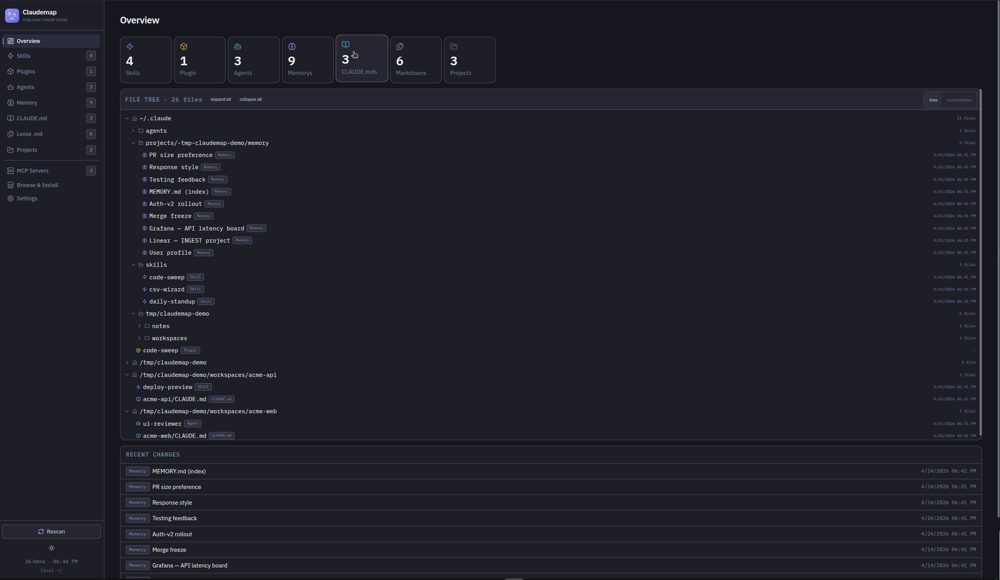

# claudemap

A **local web dashboard** for your whole `~/.claude/` — skills, agents, plugins, MCP servers, memory, marketplaces, project-scoped config, and **live Claude Code sessions**.

It runs a Next.js app on `http://127.0.0.1:3737`. Browse, toggle, edit, promote/demote, install, uninstall, watch running sessions — without hunting through scattered JSON and Markdown.



> Not a Claude Code plugin. It's a plain local server you start yourself and leave running — a host-introspection tool that needs real filesystem, process, and (for the Sessions terminal buttons) GUI access, none of which fit the plugin/container model.

---

## Quick start

```bash
git clone https://github.com/aminetroudi/claudemap
cd claudemap
bun install
./claudemap.sh start      # builds on first run, then serves detached on :3737
```

Open `http://127.0.0.1:3737`. The server is **detached** — it keeps running after you close the terminal that launched it.

For development with hot reload:

```bash
bun run dev               # :3000, hot reload
```

---

## Running & stopping

`claudemap.sh` manages a detached production server (bound to `127.0.0.1` only):

```bash
./claudemap.sh start      # build if needed, start detached
./claudemap.sh stop
./claudemap.sh restart
./claudemap.sh status
./claudemap.sh logs       # tail ~/.claudemap.log
```

Override the port: `PORT=4000 ./claudemap.sh start`.

It survives the shell that launched it, but **not a reboot**. To start it at login, add a cron line:

```cron
@reboot cd $HOME/workspace/claudemap && ./claudemap.sh start
```

Your data (skills, plugins, settings, sessions) is read live from `~/.claude/` via `$HOME` — nothing is copied or cached elsewhere.

---

## What it shows

| Section       | What you see                                                                 |
| ------------- | ---------------------------------------------------------------------------- |
| Overview      | Stat grid + recent changes across your whole Claude setup                    |
| **Sessions**  | **Live Claude Code sessions, history, and usage** (see below)                |
| Skills        | All skills (global + project), view/edit `SKILL.md`, promote/demote          |
| Plugins       | Installed plugins, enable/disable, uninstall                                 |
| Agents        | Agent definitions, scope (global vs project), edit frontmatter               |
| Memory        | Memory files indexed via `MEMORY.md`, view/edit                              |
| CLAUDE.md     | All `CLAUDE.md` files found under scanned paths                              |
| Loose `.md`   | Stray Markdown that might belong as a skill/agent/memory                     |
| Projects      | Projects discovered in `~/.claude/projects/`                                 |
| MCP Servers   | Local (`~/.claude.json`, `~/.mcp.json`, per-project) + cloud MCP — add/edit/delete |
| Marketplace   | Browse and install plugins from configured marketplaces                      |
| Settings      | Scan paths, depth, and ignore rules                                          |

Plus a `⌘K` command palette for quick navigation and item search.

---

## Sessions

A live monitor for your Claude Code sessions, parsed from `~/.claude/projects/*/*.jsonl` and the `claude agents` process list. Three tabs:

- **Live** — currently-active sessions (working / needs input / waiting), updated every ~2 s over SSE. Per row: status, project, **context-window bar** (with `(1M)` for extended-window models), origin (terminal/IDE — incl. **Tilix**, which upstream tooling misses), git branch, last activity, and the current task. Inactive sessions drop to History.
- **History** — past sessions within a day window, grouped Today / Yesterday / date, filterable by project or first prompt.
- **Usage** — local token usage over a rolling 5-hour window per session, plus your **API quota** (5-hour / 7-day utilization bars with reset countdowns) and Claude service status.

Click any row for a **detail drawer**: token/turn/tool metrics and a paginated, filterable message timeline.

**Actions** (per row):

- **Attach** — for background agents: opens a terminal running `claude attach <id>` (detach with `Ctrl+Z`, the agent keeps running).
- **Terminal here** — for running interactive sessions: opens a new shell in the session's directory.
- **Resume** — for past sessions: opens `claude --resume <uuid>`.
- **Kill ghosts** — SIGTERM processes that are alive but idle > 1 h (re-verified against `ps comm` to avoid PID reuse).

**Noise control:**

- Plugin/skill/hook-spawned sessions (e.g. claude-mem observers) are **hidden by default** — toggle "Show plugin sessions".
- Sessions whose working directory is under a configured **excludePath** (Settings) are filtered out entirely.

---

## Configuration

| Env var  | Default | What it does                       |
| -------- | ------- | ---------------------------------- |
| `PORT`   | `3737`  | Port the dashboard listens on      |

`claudemap.sh` logs to `~/.claudemap.log`. The dashboard's own config (scan paths, excludePaths) lives at `~/.claude/claude-dashboard.config.json` and is editable from the Settings tab.

---

## Security

This is a **local power-user tool**, not a hosted service. It reads and writes files under `~/.claude/`, spawns terminals, and can signal processes.

- The server binds to **`127.0.0.1` only** (`claudemap.sh`). It has no auth — **never expose the port**.
- Mutating API routes enforce a **same-origin check** (`src/middleware.ts`): a malicious page can't silently POST/PUT/DELETE to the local API.
- The session **timeline/metrics** endpoints resolve symlinks and require the target under `~/.claude/projects/` ending in `.jsonl` — no arbitrary file read.
- Terminal spawning uses **argv arrays only** with strict regex-validated tokens (attach id, session UUID) and a cwd that must resolve under `$HOME` — no shell-string interpolation.
- Ghost kill is **SIGTERM only**, after re-verifying the PID still maps to a `claude` process.
- Your **OAuth token** (read for the quota view) never leaves the server — responses carry utilization percentages only, never the token.
- Trash actions move files to a reversible trash, but back up `~/.claude/` before bulk operations.

> Run it where you develop, not on a shared machine, jumphost, or production server.

---

## Demo mode (for screenshots / evaluation)

The repo ships a curated fixture `$HOME` at `fixtures/demo-home/` — fake skills, agents, plugins, MCP servers, memory entries. Boot a separate dashboard against it without touching your real `~/.claude/`:

```bash
bun install && bun run build       # one-time
node scripts/demo-run.mjs          # http://127.0.0.1:3738
```

- Demo `$HOME` is assembled at `/tmp/claudemap-demo/` — override with `CLAUDEMAP_DEMO_HOME`.
- Reseed (after editing via the UI) with `CLAUDEMAP_DEMO_RESEED=1 node scripts/demo-run.mjs`.
- Stop with Ctrl+C. Nothing persists outside `/tmp/claudemap-demo/`.

---

## Stack

- Next.js 16 (App Router) + React 19
- Tailwind v4 + custom CSS design tokens
- `lucide-react` icons, `framer-motion` animations, `cmdk` command palette
- `zod` for config validation, `gray-matter` for frontmatter, `fast-glob` for scanning
- bun for runtime, package manager, and lockfile

---

## Project layout

```
claudemap.sh              # detached local runner (start/stop/restart/status/logs)
scripts/
  demo-run.mjs            # boot the dashboard against the demo fixture
  gen-icons.mjs           # PWA icon generation
src/
  app/
    api/                  # REST handlers (items, mcp, file, actions, config,
                          #   projects, marketplaces, search, sessions/*)
    layout.tsx            # root layout, next/font, metadata
    page.tsx              # single-page shell
  components/             # Sidebar, Viewer, panels, CommandPalette, …
    sessions/             # SessionsPanel deps: HistoryView, SessionDrawer,
                          #   UsageView, format helpers
  lib/
    paths.ts              # derives all ~/.claude file locations from $HOME
    config.ts             # dashboard's own config (scan paths, excludePaths)
    actions.ts            # trash/promote/demote/install/uninstall/read/write
    client.ts             # typed fetch wrappers for /api/*
    scanners/             # per-kind scanners (skills, agents, plugins, mcp, …)
    sessions/             # session monitor: discover, jsonl, status, context,
                          #   origin, history, timeline, usage, quota, ghosts,
                          #   terminal, classify, pathguard, hub
  middleware.ts           # same-origin CSRF hardening
public/
  icon-192.png, icon-512.png, manifest.json
```

---

## Paths the app touches

All derived from `$HOME` in `src/lib/paths.ts`:

| Path                                          | Purpose                                      |
| --------------------------------------------- | -------------------------------------------- |
| `~/.claude/`                                  | Skills, agents, plugins, marketplaces, settings, projects |
| `~/.claude/projects/<key>/*.jsonl`            | Session logs (Sessions monitor)              |
| `~/.claude/.credentials.json`                 | OAuth token (read server-side for quota; never returned) |
| `~/.claude/claude-dashboard.config.json`      | This app's own config (scan paths, excludes) |
| `~/.claude.json`                              | Claude's main config (includes `mcpServers`) |
| `~/.mcp.json`                                 | Host-level MCP servers                       |

---

## Scripts

```bash
bun run dev     # dev server (hot reload) on :3000
bun run build   # production build
bun run start   # serve production build (use ./claudemap.sh for detached + localhost bind)
```

---

## Conventions

See `AGENTS.md`. This repo targets **Next.js 16** with breaking changes vs. older versions. If something feels off while contributing, consult `node_modules/next/dist/docs/` before assuming your memory of Next is correct.

---

## License

[MIT](./LICENSE) © Mohamed Amine Troudi
